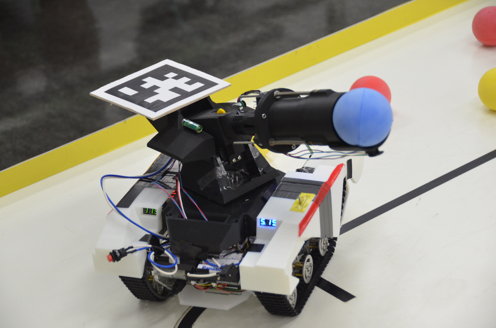

## 知能ロボコン機体の開発
* 機体名 : one-cannon
* １つのアームで、ボールの吸引回収と射出を行う戦車型の自律ロボット
* 学部３年次の研究テーマとして、３人チームで開発

## 知能ロボットコンテストとは
* スタート時を除いて人為的な操作を一切禁止された、自律型ロボットの大会
* 赤・青・黄のボール15個を、それぞれの色のゴールに入れると得点となる

    [公式HPのリンク](http://www.inrof.org/irc/)      　  

## 写真

one-cannon / 戦車型の自律走行ロボット

  

3人チームで開発

  

## デモ動画
知能ロボコンの練習時のデモ動画。

<video controls width="640">
  <source src="movies/irc_demo_01_lite.mp4" type="video/mp4">
  Your browser does not support the video tag.
</video>

下記、YouTube版

## ポスター

## 前期ポスター発表
[📂前期ポスターのPDFを開く](1st_poster.pdf){:target="_blank"}

## 後期ポスター発表
[📂後期ポスターのPDFを開く](2nd_poster.pdf){:target="_blank"}

## 制作したロボットの機能
* ボールの回収はDCモータによる吸引機構で行う
* ボールの射出はラック&ピニオン機構により、バネをモータで圧縮し射出する
* 外部カメラからの角度・距離データをもとにエンコーダを用いて旋回・直進
* ロボットの位置・姿勢は「April Tags」という取り付けたタグを用いて推定
* ボールの位置・色の認識は「OpenCV」を用いた画像処理で行う
* フォトリフレクタを7個使用し、ボールエリアまでライントレース
* 圧力センサで吸引機構のボール有無を確認
* ボールや壁への接触はリミットセンサと圧力センサで回避
* 吸引時の首振り機能により吸引範囲の拡大
* ゴール方向の旋回を3パターン用意し、最短経路でゴール方向へ照準を合わせる

